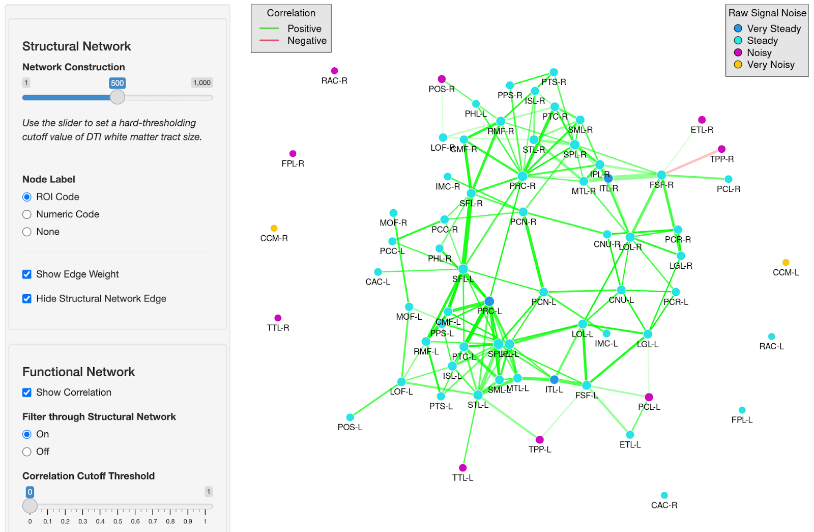

## Overview

The app visualizes brain network data and illustrates the foundations of Gaussian Markov random field model construction, including structural network formation, neighborhood-only dependencies, and spectral clustering.

<https://hnaganob.shinyapps.io/brain-network/>

It aims to explain how the brain functions as a system through its structural network.

 

[{width="80%" fig-align="center"}](https://hnaganob.shinyapps.io/brain-network/)

 

## Data

-   Scaled (z-scored) resting-state fMRI BOLD signals from 68 ROIs with TR $=$ 2s (240 x 68)
-   Diffusion Tensor Imaging (DTI) white matter tract structure (68 x 68)
