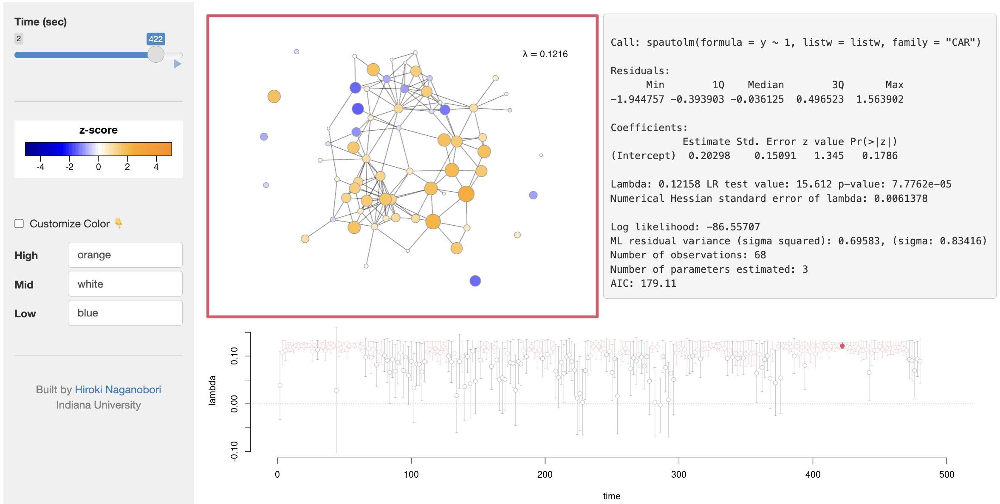

## Overview

Brain network analysis with the conditional autoregressive (CAR) model using `spdep` and `spatialreg` packages [@Bivand2021].

<https://hnaganob.shinyapps.io/car-brain-network-analysis/>

-   Displays BOLD signal data and CAR model results with the inferred spatial dependence parameter at each time point.
-   Tracks the dynamics of functional synchronization over a given spatial structure during rest.

## Data

-   Scaled (z-scored) resting-state fMRI BOLD signals from 68 ROIs with TR $=$ 2s (240 x 68)
-   Diffusion Tensor Imaging (DTI) white matter tract structure (68 x 68)

 

[{width="80%" fig-align="center"}](https://hnaganob.shinyapps.io/car-brain-network-analysis/)

 

## References
