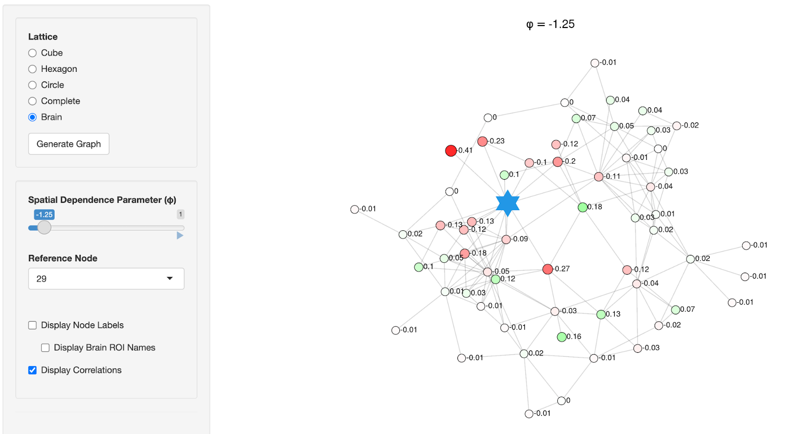

## Overview

The app computes the graph-specific admissible range of conditional autoregressive (CAR) model spatial dependence parameters and displays model-based correlations between a selected seed node and all other nodes.

[Launch App](https://hnaganob-car-dependence-parameter-diagnostics.share.connect.posit.cloud){.btn .btn-primary .rounded-pill role="button"}

It demonstrates how triadic structures influence spatial autocorrelation patterns by cubic and hexagonal lattices.

 

[{width="80%" fig-align="center"}](https://hnaganob.shinyapps.io/car-dependence-parameter-diagnostics/)
