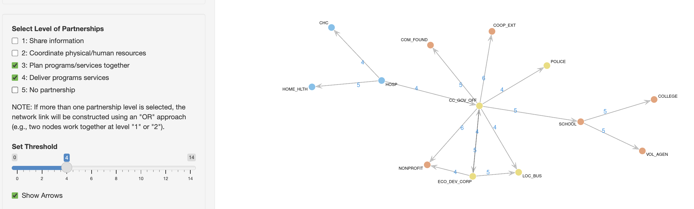

## Overview

Development of partnership network structure based on questionnaire data.

[Launch App](https://hnaganob.shinyapps.io/covid-partnerships/){.btn .btn-primary .rounded-pill role="button"}

Statistical consulting project conducted in collaboration with:

**Priscilla A. Barnes, Ph.D.**  
Associate Professor  
Department of Applied Health Science, School of Public Health, Indiana University Bloomington

 

[{width="90%" fig-align="center"}](https://hnaganob.shinyapps.io/covid-partnerships/)
