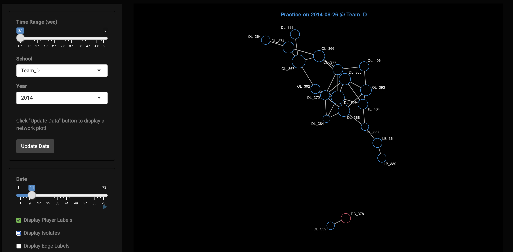

## Overview

Football concussion exploratory analysis. This app generates a network structure for each activity day based on simultaneous head impacts derived from multiple independent, time-sensitive accelerometer data streams.

[Launch App](https://hnaganob.shinyapps.io/football-clustered-head-impact-network/){.btn .btn-primary .rounded-pill role="button"}

 

[{width="80%" fig-align="center"}](https://hnaganob.shinyapps.io/football-clustered-head-impact-network/)
