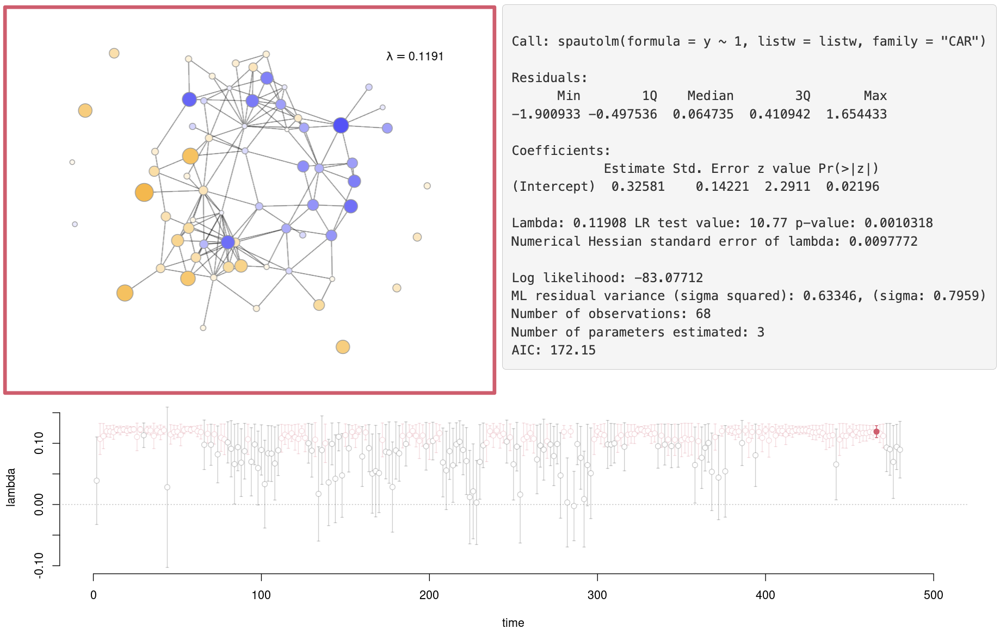

## Overview

I apply the CAR model, a Markov random field model with Gaussian data, to analyze functional magnetic resonance imaging (fMRI) blood-oxygenation-level-dependent (BOLD) signals on a structurally defined brain network. Using the `spdep` and `spatialreg` packages in R [@Bivand2021], I quantify the level of spatial synchronization through a single spatial dependence parameter.

## Data

-   Scaled (z-scored) resting-state fMRI BOLD signals from 68 ROIs with TR $=$ 2s (240 x 68)
-   Diffusion Tensor Imaging (DTI) white matter tract structure (68 x 68)

## Related Work

A corresponding R Shiny interactive web application is under development.

[*CAR Brain Network Analysis*](../../../../portfolio/shiny/brain/car-brain-network-analysis/)

It computes the CAR model summary at each time point of fMRI BOLD signals, and tracks the dynamics of functional synchronization over time. The app will be further developed to allow users to upload their own functional and structural data for spatial model-based analysis.

 

{width="80%" fig-align="center"}

## References
