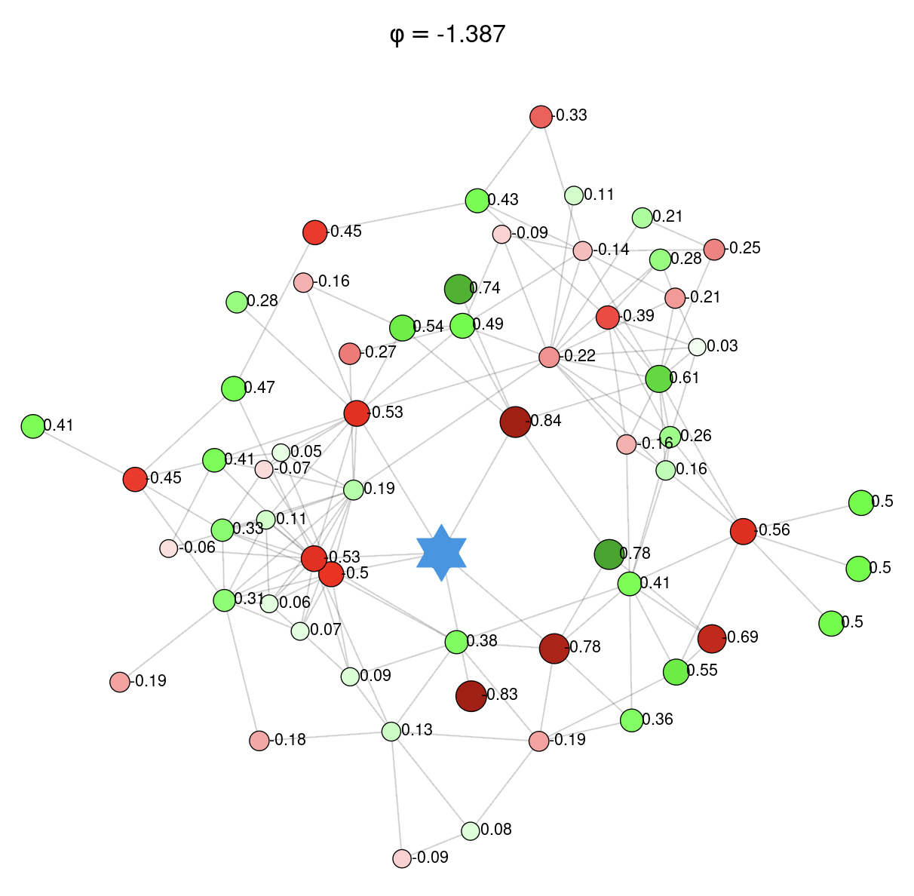

## Overview

::: epigraph
> "The opposite of love is not hate, it’s indifference."\
> — Elie Wiesel
:::

The statement by the Nobel Peace Prize laureate [@Wiesel1986] can be interpreted through the lens of graph theory.

Define

**love** as perfect positive correlation ($\rho = +1$);

**hate** as perfect negative correlation ($\rho = –1$);

**the opposite of love** as the most negative possible relationship.

In a simple graph of two nodes, the opposite of love is indeed hate. However, in a highly connected graph where each node is connected to many other nodes, the opposite of love approaches statistical independence ($\rho = 0$), which corresponds to indifference.

Building on this conceptual framework, I offer an interpretation of negative spatial autocorrelation in graphs. 
Using a random walk based simulation algorithm, I generate synthetic network data that are negatively autocorrelated and intrinsically consistent with the underlying graph structure. 
This enables systematic exploration of how graph topology, particularly clustering and node degree, affects the emergence and behavior of negatively correlated spatial structures.

## Related Work

To support this analysis, I developed an interactive Shiny web application which computes the graph-specific admissible range of the spatial dependence parameter.

[*CAR Dependence Parameter Diagnostics*](../../../../portfolio/shiny/brain/car-dependence-parameter-diagnostics/)

The app demonstrates how negative spatial dependence produces unintuitive pairwise correlations among nodes, especially under complex graph structures. This tool helps reveal that negative autocorrelation does not simply invert positive relationships, but instead reflects deeper structural dynamics in the network.

 

{width="60%" fig-align="center"}

 

## References
