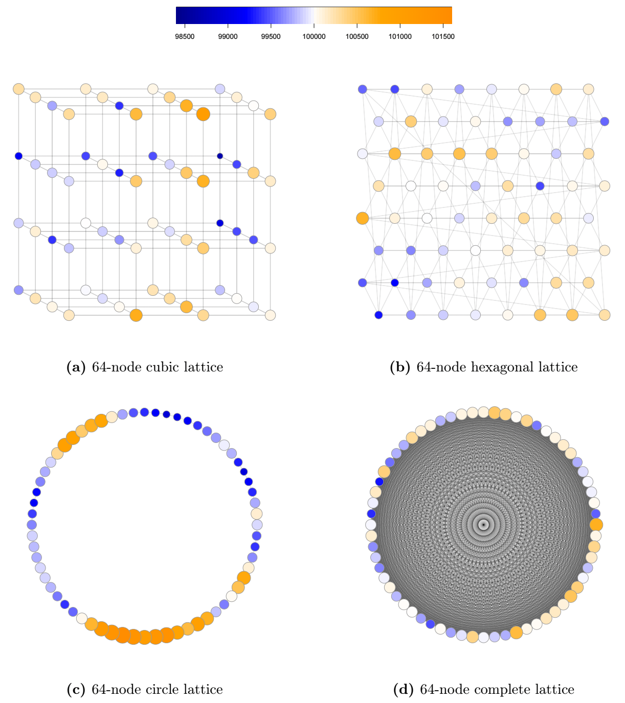

## Overview

I simulate spatially autocorrelated data using random walk algorithms on both regular graph structures (e.g., circle, cubic lattice, hexagonal lattice) and irregular structures (e.g., brain networks) to understand how topological features influence data behavior. 
Special attention is given to the role of local clustering (e.g., triads) in shaping random walk dynamics, as these motifs introduce higher-order dependencies that affect spatial diffusion.

To assess spatial dependence in graph-based data, I propose a novel framework for null hypothesis testing. 
Rather than adopting the conventional null hypothesis of no spatial dependency, I argue that the null spatial dependence parameter should be graph-structure-specific. 
Using a custom random walk simulation algorithm, I estimate the expected spatial autocorrelation under each graph’s topology, thereby defining a meaningful null model for inference.

 

{width="60%" fig-align="center"}

 

## Related Work

A corresponding R Shiny interactive web application is under development.

[*Drunk Santa Claus*](../../../../portfolio/shiny/brain/drunk-santa-claus/)

Also, this simulation-based approach is implemented in the `drunksc` (“Drunk Santa Claus”) R package, which provides tools to generate spatially autocorrelated data, compute graph-specific reference dependence parameters, and facilitate hypothesis testing on arbitrary graphs. 
The package is under active development and will serve as a foundation for reproducible spatial simulations in network-based research.

